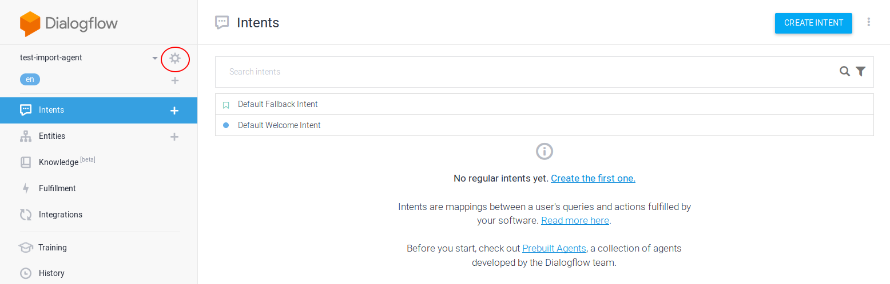
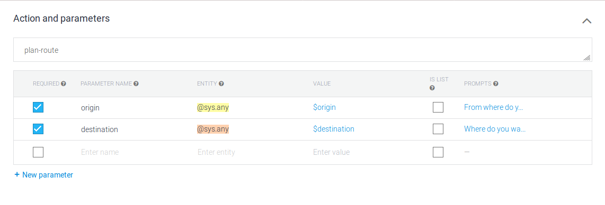

# Google Assistant Demo

This project is a small demo on how you can use data from Trafiklab.org, with the help of the Trafiklab PHP SDKs, 
and use it to create a Google Assistant bot with the help of DialogFlow.

DialogFlow is a framework which can handle input from and output to various assistants, including Google Assistant. It
can send requests to a so-called 'webhook', which can create a dynamic reply. The image below can help you understand
how this all works together.

The project is based on Laravel Lumen. It requires PHP 7.1 or higher on the host.

## Installation

### DialogFlow

The DialogFlow project which is used to link Google Assistant has been exported to 
[a zip file](https://raw.githubusercontent.com/trafiklab/google-assistant-demo/master/docs/dialogflow-stockholm-public-transport.zip), 
and can be downloaded and imported to your own DialogFlow project. In order to do this, you need to create a new agent first.
After creating a new agent, you click the gear wheal in the top left, next to your agent name.

After going to the settings, choose the Export and Import tab. Choose `Restore from zip` to clone the project from the zip file.
Read [the dialogflow docs](https://dialogflow.com/docs/agents/export-import-restore) for more information. 
 
### Webhook
In order to deploy your webhook, you can use Heroku as a free and easy hosting service. This repository already contains 
the needed configuration. If you want to set up everything automatically, you can do so by clicking the deploy button on top of
this readme, or by clicking [here](https://heroku.com/deploy). 

If you want to set-up automatic deploys for a fork of this application, we have written 
[a tutorial on heruku](https://trafiklab.github.io/blog/heroku-free-hosting-with-automatic-deploy/), 
[another good tutorial on how you can deploy to Heroku can be found here](https://github.com/dwyl/learn-heroku), 
or you can read read [the official documentation](https://devcenter.heroku.com/articles/github-integration).
 
If you choose to host this project yourself, download the project to the location and run `composer install`. When configuring
 the web server, you need to use `/public` as the root directory of the project.

Ensure that you update your DialogFlow project with the correct fulfillment URL. This is the URL to which dialogflow will send
its requests. You can change this by going to [the DialogFlow console](https://console.dialogflow.com), and going to the fulfillment page for your agent. The domain
there should correspond with your own domain, or the one generated for your Heroku project.

## Usage
Send requests from DialogFlow to the `/dialogflow/intent/handle` endpoint.
Supported intents:
- `next-departure` to get the next departures from a stop, with parameters:
    - `transportation-method`: bust, tram, train, metro, ferry
    - `location`: stop location name
    
- `plan-route` to plan a route from A to B, with parameters:
    - `origin`: Origin stop location name
    - `destination`: Destination stop location name
    
When using your own DialogFlow agen, ensure that both the intent action (for example `plan-route`) and parameters are 
correctly configured in your agent. If they are not correctly configured, the intent will not be recognized correctly.
An example configuration can be seen in the image below.

## Forking, reporting issues and creating pull requests

This project is meant as an example and base to create your own, better version of it.
We encourage you to fork it, improve on it, and to publish your own version on chatbot platforms like Google Assistant or Alexa. 

Should you find a bug in our code, feel free to report it, or to create a pull request for it. Pull requests will be accepted for
bug fixes, but may not always be accepted for adding new (large) features.   
